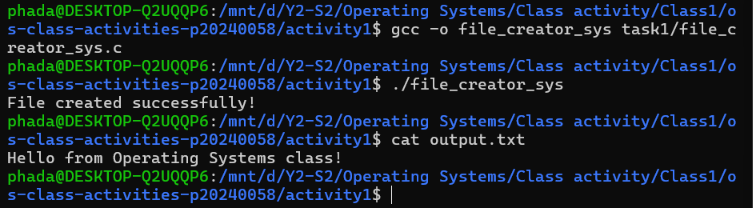
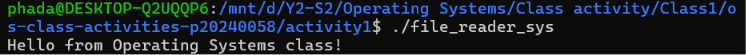
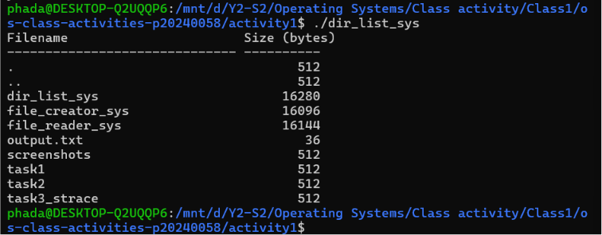
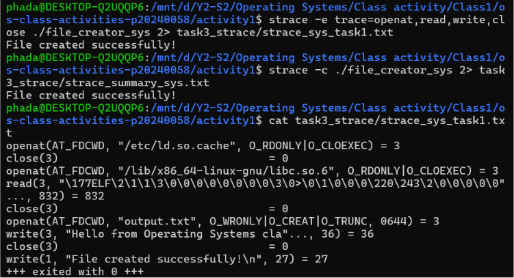
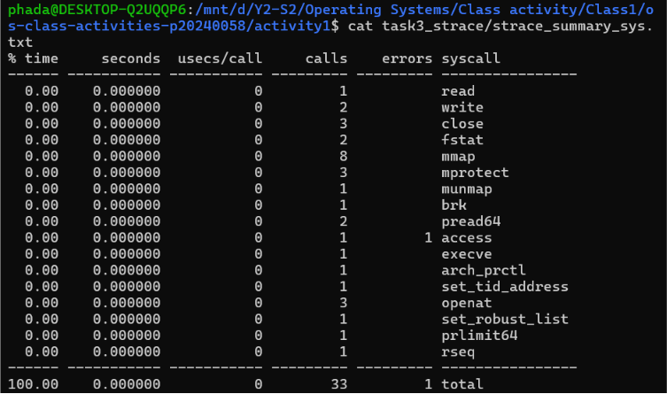

# Class Activity 1 — System Calls in Practice

- **Student Name:** Nhem Phada
- **Student ID:** p20240058
- **Date:** June 14, 2026

---

## Warm-Up: Hello System Call

Screenshot of running `hello_syscall.c` on Linux:


Screenshot of running `copyfilesyscall.c` on Linux:


---

## Task 1: File Creator & Reader
### Part A — File Creator

**Version A — Library Functions (`file_creator_lib.c`):**


**Version B — POSIX System Calls (`file_creator_sys.c`):**


### Questions:
1. **What flags did you pass to `open()`? What does each flag mean?**
   > I passed `O_WRONLY | O_CREAT | O_TRUNC`. `O_WRONLY` opens the file for writing only. `O_CREAT` creates the file automatically if it doesn't exist yet. `O_TRUNC` truncates/wipes out any pre-existing text inside the file back to length zero so it starts clean.
   
2. **What is `0644`? What does each digit represent?**
   > `0644` represents traditional Unix file permissions using the octal numbering system. The leading `0` designates an octal prefix. The `6` (4+2) gives read and write rights to the User/Owner. The first `4` sets read-only rights for the Group. The trailing `4` sets read-only access for Others.
   
3. **What does `fopen("output.txt", "w")` do internally that you had to do manually?**
   > Internally, `fopen()` runs an abstraction layer that executes the lower-level kernel system function `open()` with matching flags (`O_WRONLY | O_CREAT | O_TRUNC`). It also handles creating a dedicated dynamic memory data buffer block in user-space to cache output streams.

### Part B — File Reader & Display

**Version B — POSIX System Calls (`file_reader_sys.c`):**


### Questions:
1. **What does `read()` return? How is this different from `fgets()`?**
   > `read()` is a system call that returns an explicit signed count variable (`ssize_t`) showing the exact number of bytes successfully pulled from the file descriptor. It returns `0` when it reaches the End-Of-File (EOF) and `-1` on failure. `fgets()` is a higher-level library function that reads line-by-line and returns a character string array pointer, stopping automatically at line breaks (`\n`) rather than fixed buffer block limits.
   
2. **Why do you need a loop when using `read()`? When does it stop?**
   > Because files can be larger than your designated temporary storage buffer size. A loop reads the file chunk-by-chunk sequentially until the total input stream reads run out. The loop ends cleanly when the `read()` execution hits the end of the file and returns `0`.

---

## Task 2: Directory Listing & File Info

### Version B — System Calls (`dir_list_sys.c`)


### Questions:
1. **What struct does `readdir()` return? What fields does it contain?**
   > It returns a pointer tracking data values in `struct dirent`. Its internal schema fields provide file properties like `d_ino` (inode address identifier), `d_off` (distance offsets), `d_reclen` (entry record size span), `d_type` (file type categorization flags), and `d_name[]` (a character array containing the exact name string).
   
2. **What information does `stat()` provide beyond file size?**
   > Beyond file size (`st_size`), it provides complex system file metadata attributes including access control mask permissions (`st_mode`), owner ID (`st_uid`), group assignment key (`st_gid`), associated system device mappings (`st_dev`), and multiple timestamps indicating last status alterations, text modifications, or reads.
   
3. **Why can't you `write()` a number directly — why do you need `snprintf()` first?**
   > The `write()` system call prints raw byte elements straight out of a memory location. If you attempt to feed it an integer value directly, it treats those raw numbers as numeric ASCII keycodes, outputting broken symbols to the console screen. `snprintf()` safely converts the values into displayable character text blocks first.

---

## Task 3: strace Analysis

### strace Output — System Call Version (File Creator)


### strace Summary - System Call Version


### Questions:
1. **How many system calls does the library version of Task 1 make compared to the system call version?**
   > The standard library version makes significantly more system calls than the raw system call version. Running the library code requires the OS to execute numerous overhead steps behind the scenes to track down, map, and link the common system libraries (`libc.so`).
   
2. **What extra system calls do you see in the library version that are not in the system call version? What do they do?**
   > I observed extra memory management calls like `brk` and `mmap` which are handled inside user space to request dynamic allocation boundary re-mappings or resource files linkages.
   
3. **When the library version calls `fprintf()`, how many actual `write()` system calls does strace show? Does it match what you expected? Why or why not?**
   > It shows exactly one `write()` call. This completely matches expectations because standard library workflows are built with optimization behaviors that bundle separate text modifications together into user-space cache blocks, firing a single write command to save on performance overhead.
   
4. **Based on the strace output, explain in your own words: What is the real difference between a library function and a system call?**
   > A library function is a high-level helper structure executing in normal user-space to provide features and abstractions. A system call is a context-switching event that safely crosses user/kernel boundaries to request restricted kernel services.

---

## Task 4: OS Structure

### OS Layers Diagram
```text
+-------------------------------------------------------------+
|                         USER SPACE                          |
|         Bash Shell       -->       ./file_creator_sys       |
+------------------------------+------------------------------+
                               | invokes system calls
                               v
+-------------------------------------------------------------+
|                    SYSTEM CALL INTERFACE                    |
|             open()   |   write()   |   read()               |
+------------------------------+------------------------------+
                               | CPU Mode Switch
                               v
+-------------------------------------------------------------+
|                        KERNEL SPACE                         |
|      Linux Kernel Version: 5.15+ (Using Modular Monolithic) |
|      Active Modules: kvm_intel, kvm, tls, bridge (via lsmod) |
+------------------------------+------------------------------+
                               | Hardware interactions
                               v
+-------------------------------------------------------------+
|                       HARDWARE LAYER                        |
|   CPU & Memory (From /proc/cpuinfo and /proc/meminfo)       |
+-------------------------------------------------------------+
Questions:
What is /proc? Is it a real filesystem on disk? Where does its content come from?

It is a virtual filesystem generated dynamically in memory by the kernel whenever an application reads from it. It doesn't use permanent storage media; instead, it accesses internal kernel tracking metrics directly on the fly.

What is the difference between a monolithic kernel and a microkernel? Based on the lsmod output, which type does Linux use?

A monolithic kernel embeds all essential tracking systems, process schedulers, and driver assets directly into one shared execution space. A microkernel minimizes core responsibilities to bare scheduling basics, shifting secondary tasks out into user space applications. The modular loading behaviors tracked via lsmod show that Linux uses a modular Monolithic approach.

Look at the output of cat /proc/self/maps. What different memory regions do you see?

I observed specific boundaries identifying application sections including execution paths (.text), static variable stores (.data), shared dynamic library boundaries (.so extensions), application heap space allocations, and the runtime application process stack.

What does the kernel version string (from uname -a) tell you? Break down each part.

It details the system OS framework name, network computer identifier names, active release iteration sequences, package build compiler timestamps, architecture foundations (like 64-bit x86_64), and operating system distributions.

How does /proc demonstrate that the OS acts as an intermediary between user programs and hardware?

It provides user-space applications with an abstracted, safe, read-only interface to read raw electronic equipment configurations (like CPU speeds and RAM states) without needing direct or hazardous hardware register access permissions.
