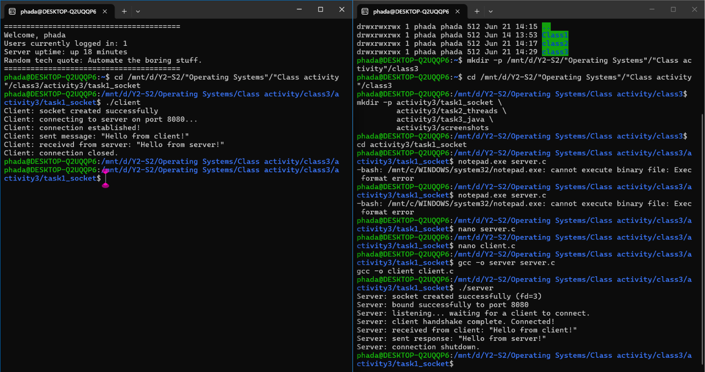
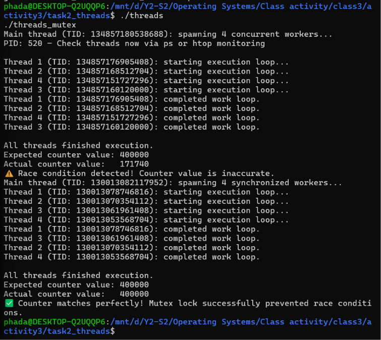
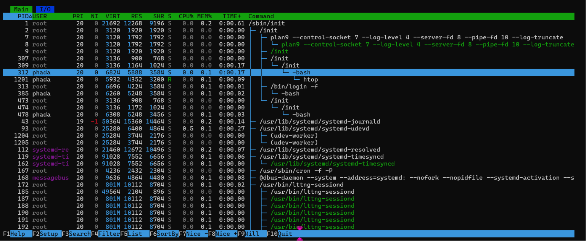

# Class Activity 3 — Socket Communication & Multithreading

- **Student Name:** Nhem Phada
- **Student ID:** p20240058
- **Date:** June 21, 2026

---

## Task 1: TCP Socket Communication (C)

### Compilation & Execution

### Answers to Questions
1. **What is the role of `bind()` in the server? Why doesn't the client call `bind()`?**
   > `bind()` associates a socket with a specific local IP address and port number (e.g., port 8080) so that incoming clients know exactly where to direct their traffic. The client does not need to call `bind()` explicitly because the operating system automatically assigns a temporary, dynamic outgoing port (ephemeral port) when the client initiates `connect()`.

2. **What does `accept()` return? How is it different from the original server socket?**
   > `accept()` blocks until a client connects, and then it returns a brand-new socket file descriptor. This new descriptor is uniquely dedicated to communicating with that specific client. The original server socket remains completely unaffected and continues listening on port 8080 for other incoming connection handshakes.

3. **What happens if you start the client before the server? Try it and describe the error.**
   > If the client is executed before the server starts, it fails instantly with a `Connection refused` error message (`ECONNREFUSED`). This happens because no process is listening on the target port to accept the TCP handshake.

4. **What does `htons(PORT)` do? Why is byte order conversion needed?**
   > `htons()` stands for "Host to Network Short". It converts a 16-bit integer (like a port number) from Host Byte Order (typically Little-Endian on modern Intel/AMD/ARM computers) to Network Byte Order (Big-Endian). This conversion ensures network data consistency between machines with different hardware architectures.

5. **Socket call sequence diagram:**
Server: socket() -> bind() -> listen() -> accept() -> read()  -> write() -> close()
^          │         ▲
│  Handshake         │ Data
▼          │         │
Client:                      socket() -> connect() -> write() -> read()  -> close()

---

## Task 2: POSIX Threads (C)

### Output — With and Without Mutex Protection

### Answers to Questions
1. **What is a race condition? Why does `shared_counter` produce an incorrect result in `threads.c`?**
> A race condition happens when multiple threads concurrently read, modify, and write back to a shared variable without synchronization. The operation `shared_counter++` looks like one action, but at the assembly layer, it consists of three distinct machine steps (Read, Modify, Write). Because the threads interleave, they read outdated values and overwrite each other's increments, resulting in a final value much lower than 400,000.

2. **What does `pthread_mutex_lock()` do? Why does it fix the race condition?**
> It enforces mutual exclusion by ensuring that only a single thread can execute the code block inside the critical section at any given time. If another thread tries to access it while it is locked, the operating system pauses that thread until the owning thread releases the lock via `pthread_mutex_unlock()`.

3. **What happens if you forget to call `pthread_join()`? Try removing it and describe the behavior.**
> If `pthread_join()` is omitted, the parent `main` thread continues executing immediately, hits the end of the program, and exits. This tears down the entire process context, forcefully terminating the child worker threads before they finish their arithmetic loop iteration cycles.

4. **How is a thread different from a process? What do threads share and what is private to each thread?**
> A process is an independent execution unit with its own private virtual memory space allocated by the OS. A thread is a lightweight execution lane nested *inside* a process. Threads share the global heap, code instructions, and open file descriptors of the parent process, but maintain their own private stack memory, program counter (PC), and CPU register values.

---

## Task 3: Java Multithreading

### Interleaved Output Logs

### Answers to Questions
1. **What is the difference between extending `Thread` and implementing `Runnable`? When would you prefer one over the other?**
> Extending `Thread` creates tight structural coupling because Java only supports single class inheritance—once you extend `Thread`, your class cannot inherit from any other object layout. Implementing `Runnable` isolates the task execution code from the thread infrastructure. This is highly preferred because it leaves the class free to extend other components and makes it compatible with thread pools.

2. **In `PoolDemo`, why do only 2 tasks run simultaneously even though 6 are submitted?**
> This occurs because the pool size was explicitly bounded to a capacity of exactly 2 using `Executors.newFixedThreadPool(2)`. The remaining 4 tasks are placed in an internal first-in, first-out (FIFO) blocking queue, waiting for one of the 2 working threads to complete its task and become free.

3. **What does `thread.join()` do in Java? What happens if you remove it from `ThreadDemo`?**
> `thread.join()` forces the calling thread (the parent `main` thread) to stall its execution until the target worker thread completes. Removing it causes the main function to instantly jump to the bottom, print its final confirmation line, and exit before the worker tasks finish their console updates.

4. **Why is `ExecutorService` considered better than manually creating threads for large applications?**
> Creating and tearing down raw OS threads manually is very resource-intensive and can cause resource exhaustion. An `ExecutorService` reuses an active pool of managed worker threads, optimizes job queuing boundaries, and handles thread lifetimes safely under high workloads.

---

## Task 4: Observing Threads

### Linux Thread Tracking View

### Windows Task Manager Details Panel

### Answers to Questions
1. **In the `ps -eLf` output, what is the LWP column? How does it relate to threads?**
> LWP stands for Light-Weight Process. In the modern Linux kernel (NPTL implementation), threads are treated as individual lightweight processes that are handled directly by the system scheduler. The LWP column displays the unique identifier (Thread ID) assigned by the kernel to each individual thread.

2. **How many entries did you find in `/proc/<PID>/task/`? Does it match the number of threads in your program?**
> It contains 5 entries. This perfectly matches the program's structure: 4 concurrent background worker threads plus 1 master parent `main` execution thread driving the lifecycle.

3. **In Task Manager, why does `java.exe` show more threads than the 3 you created? What are the extra threads?**
> The Java Virtual Machine (JVM) starts its own background daemon threads automatically to manage the application environment. These extra internal threads handle core tasks like Garbage Collection (GC), Just-In-Time (JIT) compilation profiling, and managing system reference queues.

4. **Compare how Linux (`ps`, `/proc`) and Windows (Task Manager) display threads. Which gives more detail?**
> Linux provides more granular and lower-level detail. Commands like `ps` and checking `/proc` reveal the precise LWP mappings and hardware boundaries assigned to each thread. Windows Task Manager displays a clean, aggregated thread counter value but hides the specific internal details of individual threads unless specialized external tools like Sysinternals Process Explorer are used.

---

## Reflection
> Investigating network sockets and multithreading at the operating system layer bridges the gap between hardware execution and application software. Seeing how data crosses socket interfaces and experiencing race conditions firsthand shows exactly why proper synchronization, mutual exclusion, and live process monitoring are necessary for building high-performance, concurrent systems.
