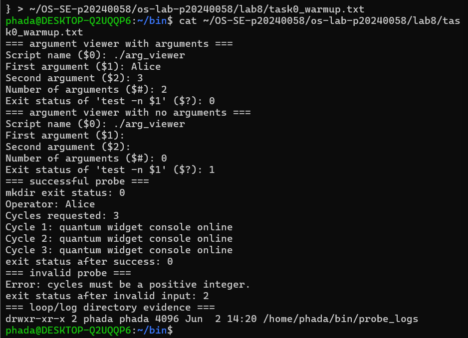
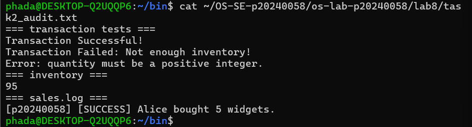
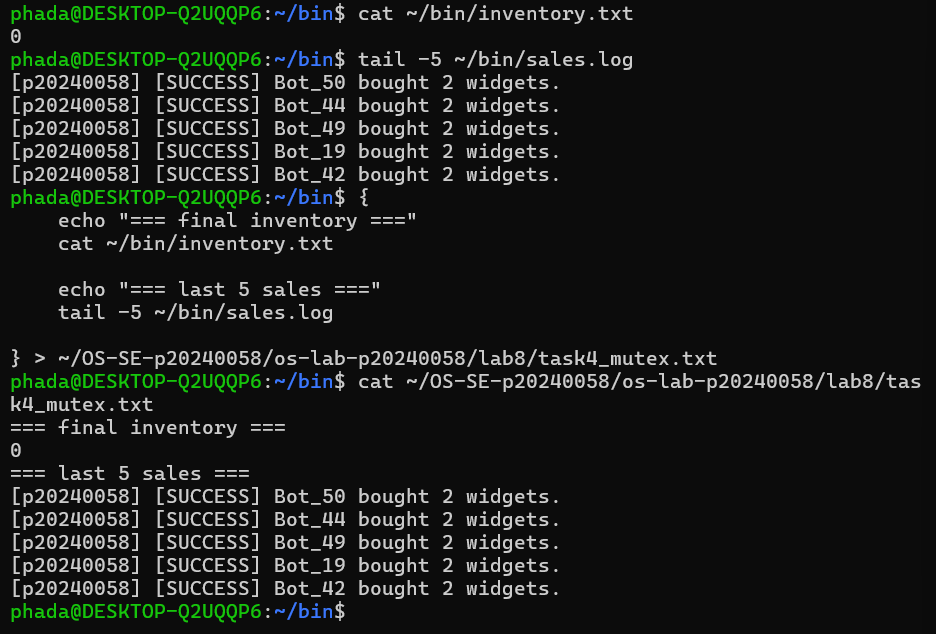
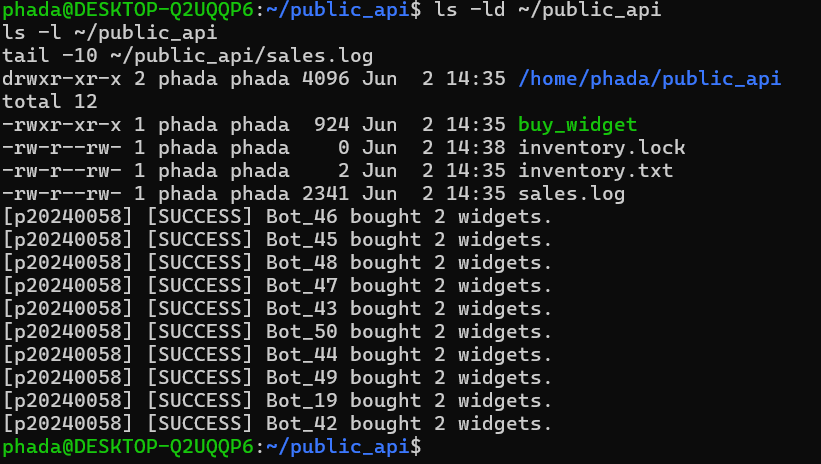
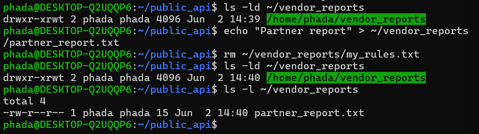
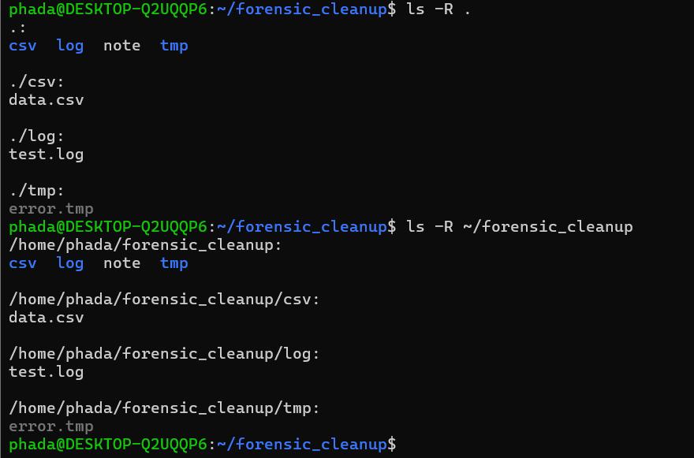

# Lab 8 - Quantum Widget Exploit

## Student Info
- Name: Phada
- ID: p20240058

## Screenshots

### Level 0 - Warmup

### Level 2 - Audit

### Level 4 - Mutex Patch

### Level 5 - Red vs Blue

### Level 6 - Dropzone

### Level 7 - Cleanup

## Lab Questions

### 1. What does TOC-TOU mean, and where did it appear?
TOC-TOU means Time-of-Check to Time-of-Use. It appeared when multiple buy_widget processes read inventory.txt at the same time before updating it, causing race conditions.

### 2. Why did bot_swarm sometimes leave different inventory values?
Because multiple processes executed concurrently without synchronization, OS scheduling caused different execution orders each run.

### 3. What is the critical section?
The critical section is the part where inventory.txt is read, updated, and written. It must be protected because multiple processes modifying it at the same time causes corruption.

### 4. How does flock -x work?
flock -x creates an exclusive lock so only one process can enter the critical section at a time, blocking others until the lock is released.

### 5. Why does sticky bit protect drop zone?
It allows everyone to write but only the file owner can delete their own files, preventing users from deleting others’ files.
