# Class Activity 1 — System Calls in Practice
# Class Activity 1 — System Calls in Practice

- **Student Name:** Nhem Phada
- **Student ID:** p20240058
- **Date:** March 2026

---

## Warm-Up: Hello System Call

Screenshot of running `hello_syscall.c` on Linux:
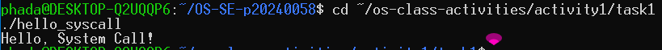

Screenshot of running `copyfilesyscall.c` on Linux:
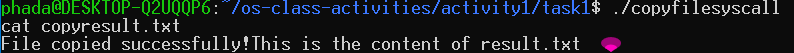

---

## Task 1: File Creator & Reader

### Part A — File Creator

**Describe your implementation:**
The library version uses `fopen()` and `fprintf()` which are C standard library
functions that handle buffering and formatting internally. The syscall version
uses `open()`, `write()`, and `close()` directly, giving us full control over
exactly what gets sent to the kernel with no hidden overhead.

**Version A — Library Functions (`file_creator_lib.c`):**
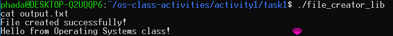

**Version B — POSIX System Calls (`file_creator_sys.c`):**
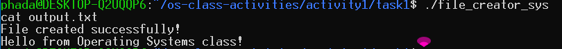

**Questions:**

1. **What flags did you pass to `open()`? What does each flag mean?**

   > I passed `O_WRONLY | O_CREAT | O_TRUNC`.
   > - `O_WRONLY` — open the file for writing only
   > - `O_CREAT` — create the file if it does not exist
   > - `O_TRUNC` — if the file already exists, erase its contents first

2. **What is `0644`? What does each digit represent?**

   > `0644` is an octal number representing file permissions.
   > - First `0` means it is octal notation
   > - `6` (owner) = read + write (4+2)
   > - `4` (group) = read only
   > - `4` (others) = read only
   > So the owner can read and write, everyone else can only read.

3. **What does `fopen("output.txt", "w")` do internally?**

   > `fopen()` internally calls `open()` with flags `O_WRONLY | O_CREAT | O_TRUNC`
   > and permission `0666`. It also allocates a FILE buffer struct in memory to
   > enable buffered I/O, which we had to manage manually with our syscall version.

### Part B — File Reader & Display

**Describe your implementation:**
The library version uses `fgets()` which reads line by line and handles
newlines automatically. The syscall version uses `read()` in a loop, reading
raw bytes into a buffer and writing them directly to stdout using `write(1,...)`.

**Version A — Library Functions (`file_reader_lib.c`):**
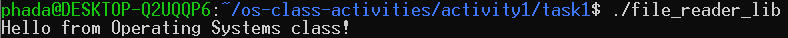

**Version B — POSIX System Calls (`file_reader_sys.c`):**
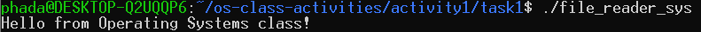

**Questions:**

1. **What does `read()` return? How is this different from `fgets()`?**

   > `read()` returns the number of bytes actually read as an integer, or 0 at
   > end of file, or -1 on error. `fgets()` returns a pointer to the buffer on
   > success or NULL at end of file or error. `read()` works with raw bytes while
   > `fgets()` works with strings and stops at newlines automatically.

2. **Why do you need a loop when using `read()`? When does it stop?**

   > You need a loop because `read()` may not read the entire file in one call —
   > it reads up to the buffer size each time. The loop stops when `read()`
   > returns 0, which means end of file has been reached.

---

## Task 2: Directory Listing & File Info

**Describe your implementation:**
The library version uses `printf()` to format and print output. The syscall
version uses `snprintf()` to format the text into a buffer first, then
`write(1, buffer, len)` to send it directly to stdout without using printf.

### Version A — Library Functions (`dir_list_lib.c`)
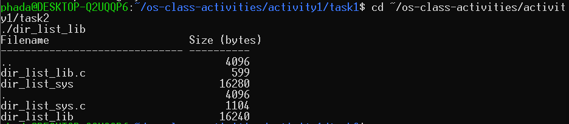

### Version B — System Calls (`dir_list_sys.c`)
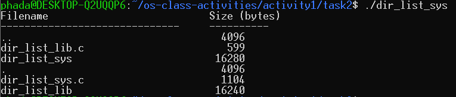

### Questions

1. **What struct does `readdir()` return? What fields does it contain?**

   > `readdir()` returns a pointer to a `struct dirent` which contains:
   > - `d_ino` — inode number of the file
   > - `d_off` — offset to next directory entry
   > - `d_reclen` — length of this record
   > - `d_type` — type of file (regular, directory, symlink, etc.)
   > - `d_name[]` — null-terminated filename string

2. **What information does `stat()` provide beyond file size?**

   > `stat()` provides: file permissions (`st_mode`), number of hard links
   > (`st_nlink`), owner user ID (`st_uid`), owner group ID (`st_gid`),
   > last access time (`st_atime`), last modification time (`st_mtime`),
   > last status change time (`st_ctime`), and device ID (`st_dev`).

3. **Why can't you `write()` a number directly?**

   > `write()` only sends raw bytes — it does not know how to convert integers
   > or format strings. A number like `4096` stored as an integer in memory is
   > binary data, not the characters "4096". We need `snprintf()` to convert the
   > number into its text representation first so `write()` can send the correct
   > human-readable characters.

---

## Task 3: strace Analysis

**Describe what you observed:**
The library version made 38 total system calls while the syscall version made
only 33. The library version had extra calls like `brk`, `fstat`, `getrandom`,
`set_robust_list` and `set_tid_address` which are overhead from the C standard
library initializing its internal memory and buffering system. The most
surprising finding was that despite the extra setup calls, `fprintf()` still
produced just one `write()` system call — same as our version.

### strace Output — Library Version (File Creator)
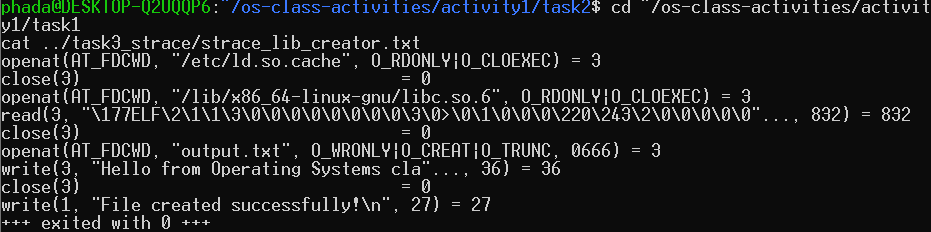

### strace Output — System Call Version (File Creator)
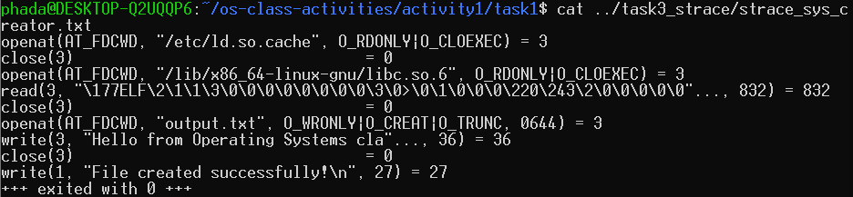

### strace Output — Library Version (File Reader)
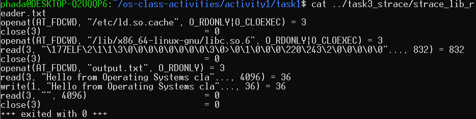

### strace Output — System Call Version (File Reader)
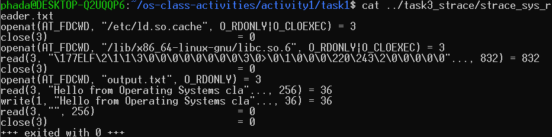

### strace -c Summary Comparison
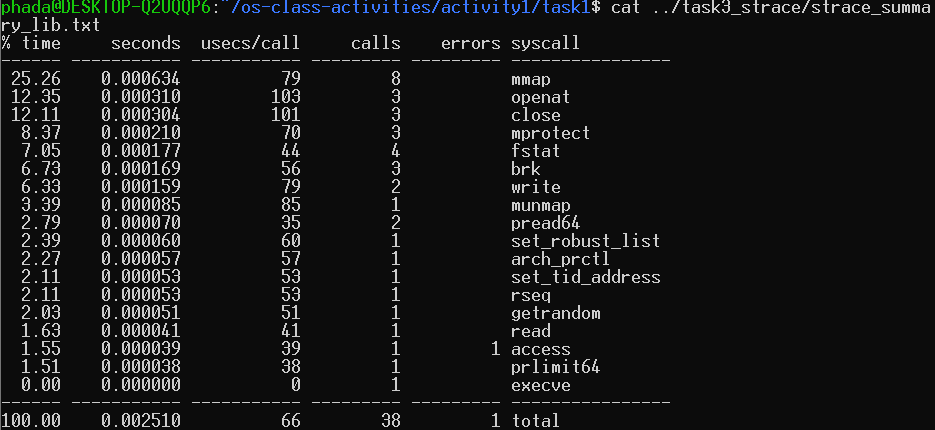
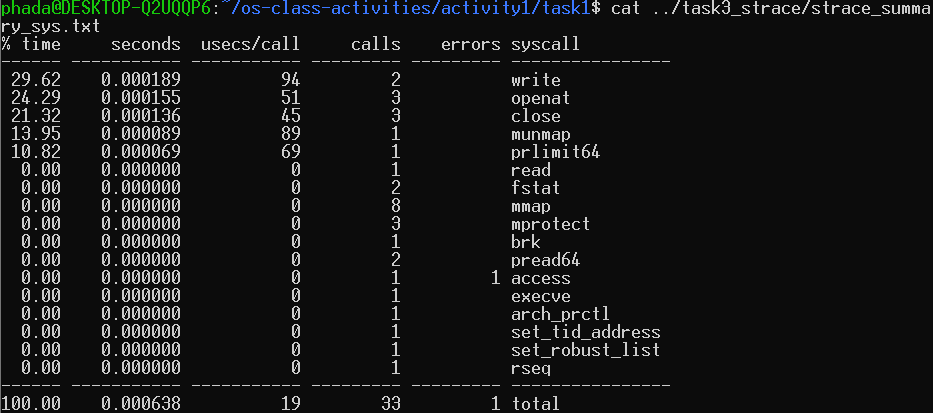

### Questions

1. **How many system calls does each version make?**

   > The library version made **38 total system calls** and the syscall version
   > made **33 total system calls**. The library version makes 5 more calls due
   > to C library initialization overhead.

2. **What extra system calls appear in the library version?**

   > - `brk` (3 calls) — manages heap memory expansion for stdio buffers
   > - `fstat` (4 calls) — checks file status, used by stdio to decide buffering
   > - `getrandom` (1 call) — generates random bytes for stack protection
   > - `set_robust_list` (1 call) — sets up thread-safe mutex list
   > - `set_tid_address` (1 call) — sets thread ID address for thread management

3. **How many `write()` calls does `fprintf()` actually produce?**

   > `fprintf()` produced exactly **1 write() system call**, same as our direct
   > `write()` call. This is because the text was small enough to fit in one
   > stdio buffer flush. For larger outputs, stdio might batch multiple
   > `fprintf()` calls into fewer `write()` calls.

4. **What is the real difference between a library function and a system call?**

   > A library function like `fprintf()` runs entirely in **user space** — it
   > adds features like text formatting, buffering, and error handling before
   > eventually calling the actual system call. A system call like `write()` is
   > a direct request to the **OS kernel** that crosses the user/kernel boundary.
   > Library functions are convenient and portable wrappers; system calls are the
   > actual interface to the hardware through the kernel.

---

## Task 4: Exploring OS Structure

### System Information

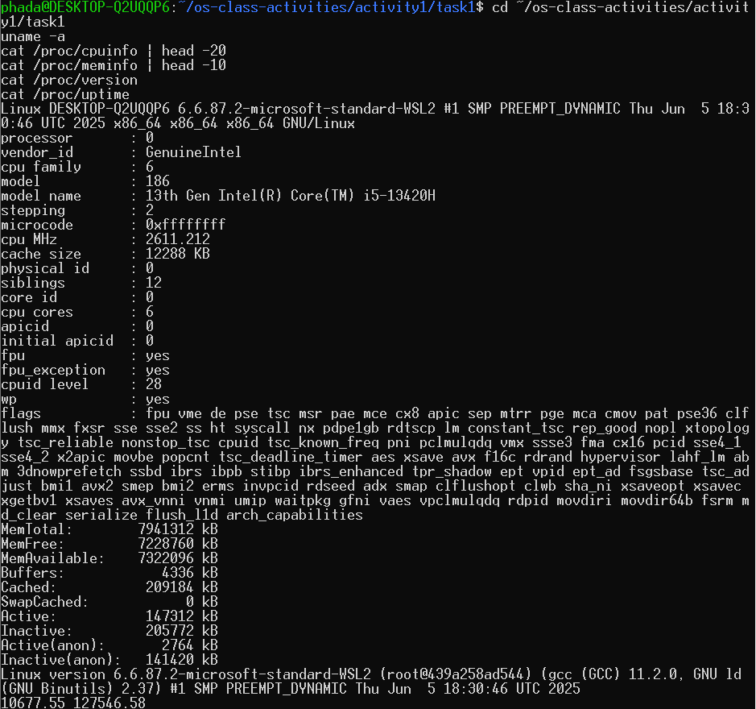

### Process Information

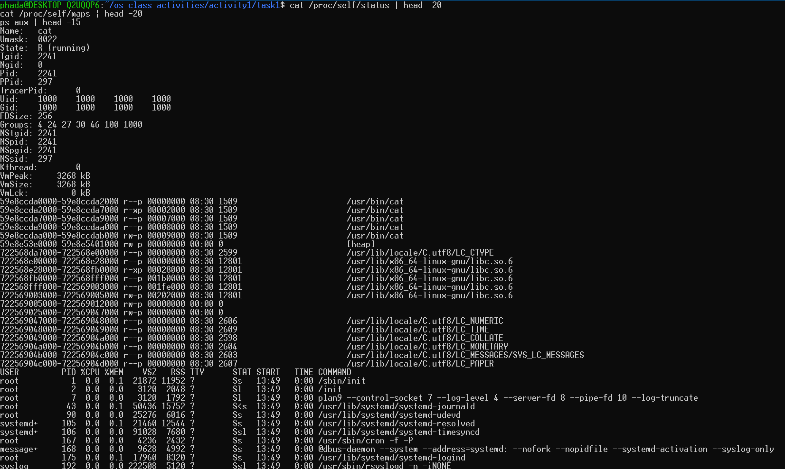

### Kernel Modules

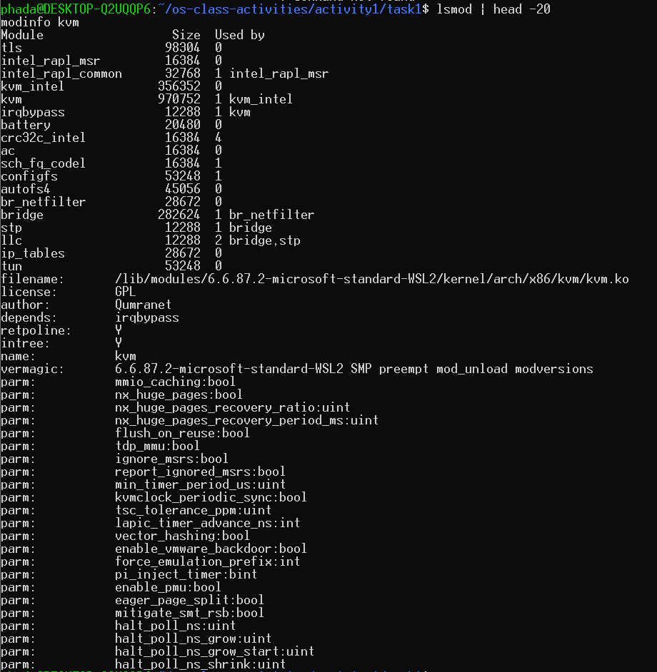

### OS Layers Diagram

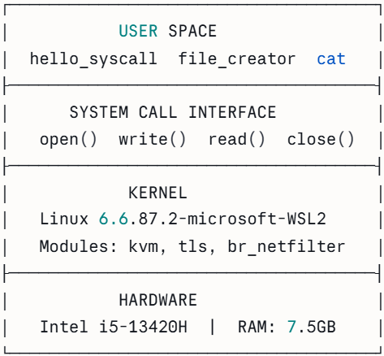

### Questions

1. **What is `/proc`? Is it a real filesystem on disk?**

   > `/proc` is a **virtual filesystem** — it does not store anything on disk.
   > It exists only in memory and is generated by the kernel on the fly whenever
   > a program reads from it. It exposes real-time information about running
   > processes, CPU, memory, and kernel internals.

2. **Monolithic kernel vs microkernel — which does Linux use?**

   > Linux uses a **monolithic kernel**, meaning most OS services (memory
   > management, file systems, device drivers, networking) run inside the kernel
   > in a single large program. A microkernel keeps only minimal services in
   > kernel space and moves everything else to user space. The `lsmod` output
   > confirms Linux is monolithic but modular — modules like `kvm`, `tls`, and
   > `br_netfilter` can be loaded/unloaded at runtime without rebooting.

3. **What memory regions do you see in `/proc/self/maps`?**

   > - `/usr/bin/cat` — the executable code of the cat program (r--p, r-xp)
   > - `[heap]` — dynamically allocated memory (rw-p)
   > - `/usr/lib/x86_64-linux-gnu/libc.so.6` — the C standard library
   > - Anonymous regions (`rw-p` with no name) — stack and private memory
   > - Locale files — character set and language data

4. **Break down the kernel version string from `uname -a`:**

   > `Linux DESKTOP-Q2UQQP6 6.6.87.2-microsoft-standard-WSL2`
   > - `Linux` — operating system name
   > - `DESKTOP-Q2UQQP6` — hostname of the machine
   > - `6.6.87.2` — kernel version (major.minor.patch.build)
   > - `microsoft-standard-WSL2` — custom Microsoft build for WSL2
   > - `x86_64` — 64-bit Intel/AMD architecture
   > - `GNU/Linux` — userland type

5. **How does `/proc` show the OS is an intermediary?**

   > `/proc` shows the OS acting as intermediary because user programs can read
   > hardware information (CPU model, memory size, running processes) without
   > directly accessing hardware. The kernel collects this data from hardware and
   > exposes it safely through `/proc`. Programs like `ps`, `top`, and `free`
   > all just read from `/proc` — the kernel handles the actual hardware access.

---

## Reflection

This activity showed me the real difference between convenience and control.
Library functions like `printf()` and `fopen()` are much easier to use but they
hide a lot of complexity — the strace output revealed that even a simple
`printf()` triggers multiple system calls for memory setup and library loading.
Writing the syscall versions directly made me appreciate how the OS kernel is
the true gatekeeper between user programs and hardware. The most surprising
discovery was seeing how `/proc` exposes live kernel data — it feels like a
window directly into the OS brain. I also learned that Linux being modular
(shown by `lsmod`) means it gets the best of both worlds: monolithic performance
with the flexibility to load/unload drivers at runtime.
