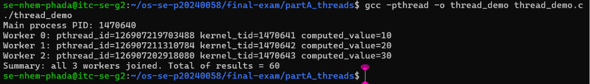
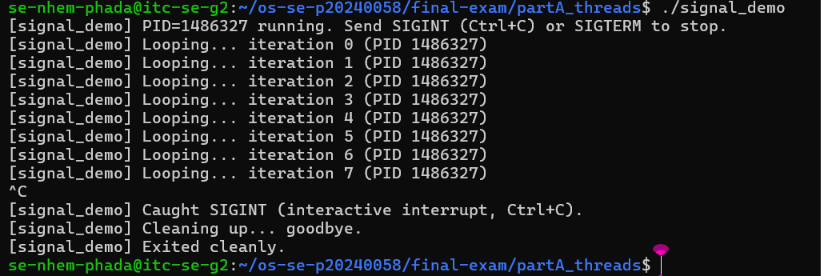
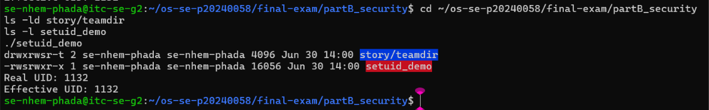
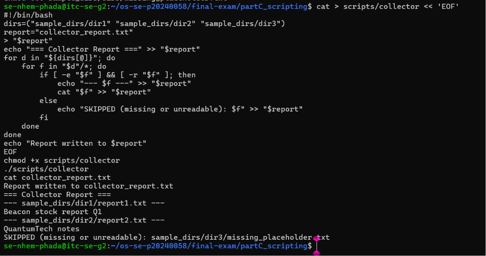
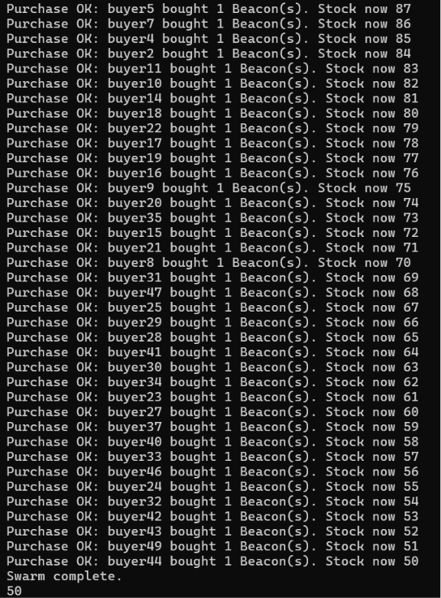
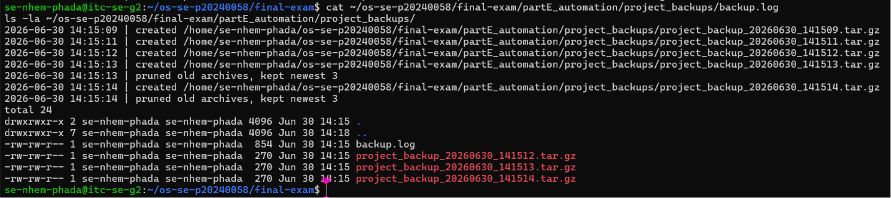

# Final Exam — Nhem Phada (龙帕拉)

<!-- ===== COVER SHEET — required first section. Fill EVERY line. ===== -->
```
Student name: Nhem Phada
Student ID: p20240058
Server username: se-nhem-phada
Exam scenario value (COMPANY / PRODUCT): QuantumTech / Beacon
Date & start time: 2026-06-30, approx 13:15 (server time)
AI assistant used (name/none): Claude (Anthropic)
```

> Exact commands per part are in `commands.md`. Live-curveball answers are in `live_mods.md`.
> Replace every `<...>` below. Keep answers tied to **your own** scenario numbers.

---

## Part A — Threads, Kernel Mapping & Signals

**Screenshots**




**Written (one short answer)**

- **Why does a worker thread's joined result reach the main thread, but a forked
  child's value would not?**
  <threads share one address space (joined value read from shared memory); a forked
  child runs in a copied address space, so its changes never reach the parent>

**Anything not completed:** <none / ...>

---

## Part B — Files, Permissions & Special Bits

**Screenshot**



**Written (one short answer)**

- **Translate your private file's final octal mode into the 9-char symbolic string**
  (e.g. `600` → `rw-------`).
  octal 600 → rw-------

**Anything not completed:** <none / ...>

---

## Part C — Bash Scripting, PATH & Safe File Scanning

**Screenshot**



**Written (one short answer)**

- **the shell only searches directories listed in $PATH for bare command names; before
  adding ~/bin, greeter could only be run as ./greeter (explicit path), not by name alone**

**Anything not completed:** <none / ...>

---

## Part D — Concurrency, a Race Condition & File Locking

**Screenshot**



**Written (one short answer)**

- **Why did the unpatched `swarm` sometimes leave more stock than the correct final
  value (with 100 stock and 50 concurrent buyers)?**
  Concurrent buyers all read the same stale stock value before any of them wrote
  back their decrement (a Time-of-Check-to-Time-of-Use race). Several processes
  computed new_stock from the same stale number, so later writes overwrote earlier
  ones (lost updates) -- fewer decrements were actually persisted than the number
  of "Purchase OK" lines printed, leaving stock higher than the correct value of 50
  (observed runs: -1, -1, 86 before the flock patch).

**Anything not completed:** <note here if the race was hard to reproduce — D3's lock is
what's graded>

---

## Part E — Backups, Archiving & cron Automation

**Screenshot**



**Note on cron timing:** the 14:35 one-shot timed_job entry and the */2 minute backup_exam
interval job both fired successfully within the exam window (see cron_recurring.log,
cron_oneshot.log, and ~/exam-backups/ listing in cron_report.txt). The 16:00 backup_exam
one-shot crontab entry is correctly installed (see `crontab -l` in cron_report.txt) but
will fire after this exam session ends, since the exam window closes before 16:00.

**Written (one short answer)**

- **Archiving vs compression — which one actually shrank the bytes, and why?**
  tar by itself only bundles many files into one container (an archive) -- it does not
  reduce total bytes, it just concatenates them with headers. The -z flag invokes gzip
  compression on top of that bundle, and gzip is what actually shrank the byte count,
  by finding and removing redundancy in the data (e.g. repeated text patterns in the
  source files). Without -z, project_backup_*.tar would be roughly the sum of the
  original file sizes; with -z, the .tar.gz came out noticeably smaller.

**Anything not completed:** <none / ...>
